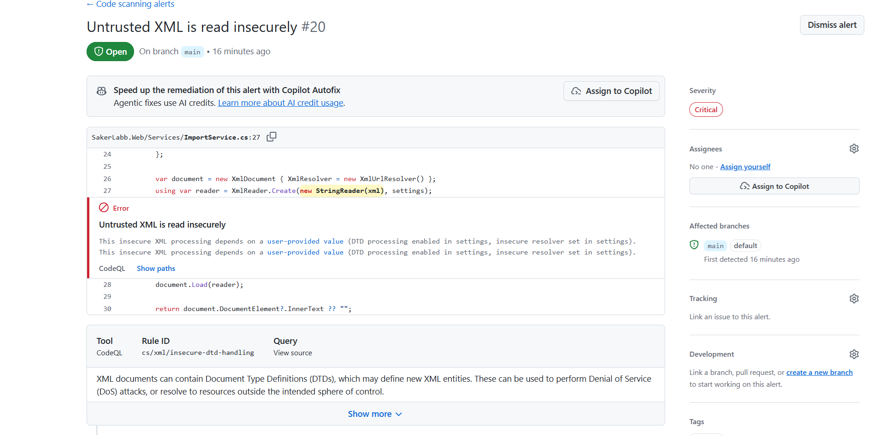
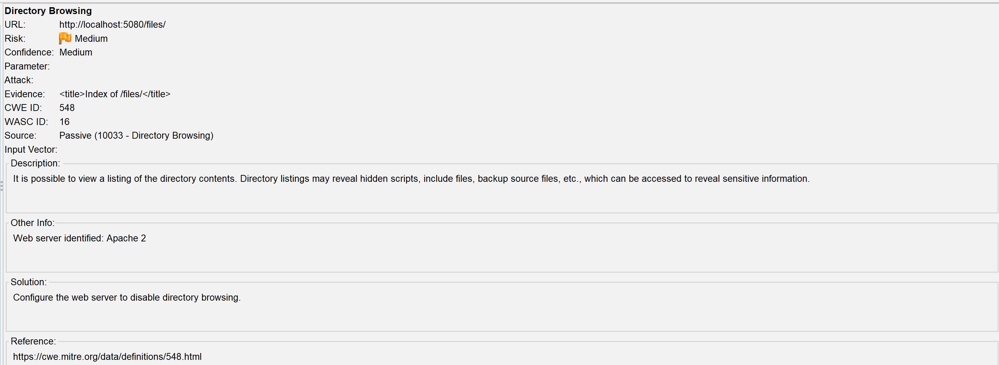
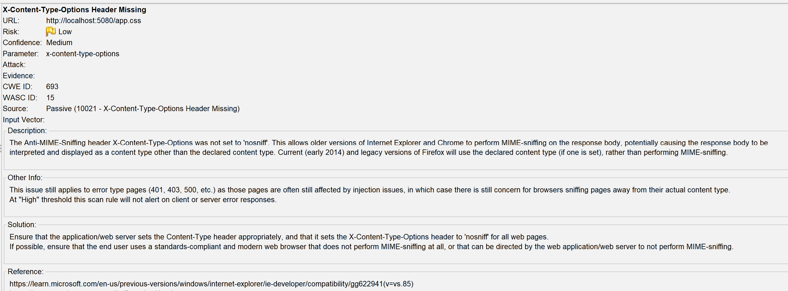
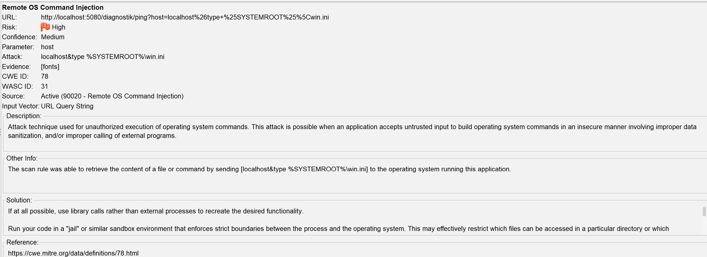
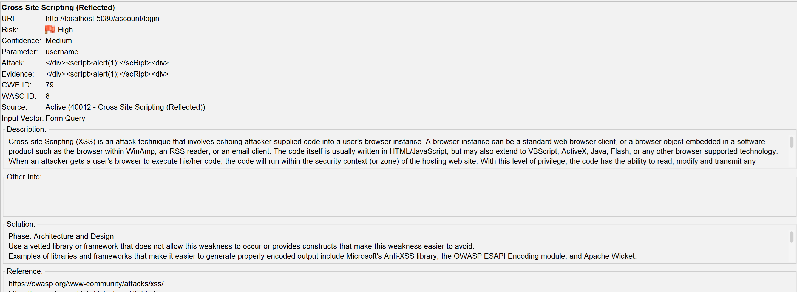
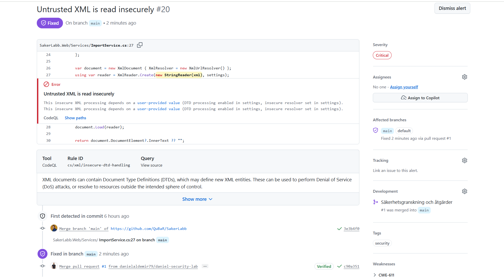
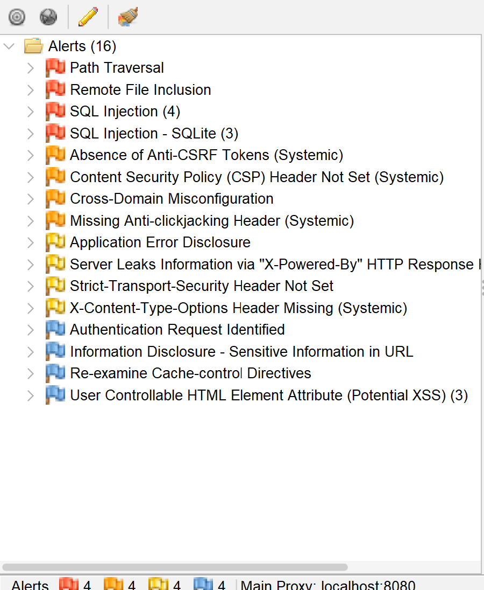

# Labbrapport: praktisk laboration

Kunskapskontroll 2, IT-säkerhet för utvecklare

**Namn:** Daniel Aldemir<br>
**Datum:** 2026-08-26<br>
**Repo:** https://github.com/danielaldemir79/SakerLabb<br>
**Applikation som analyserades:** SakerLabb Support

---

## 1. Kort om applikationen och analysen

SakerLabb Support är ett ärendehanteringssystem byggt med Blazor och .NET 10. Jag använde CodeQL med default setup och språket C# för att granska koden. Jag använde även OWASP ZAP mot `http://localhost:5080` och genomförde både passiv och aktiv skanning. Efter rättningarna körde jag verktygen igen för att kontrollera resultatet.

---

## 2. Fem fynd

| Nr | Källa (CodeQL/ZAP) | Regel-id eller alert | Allvarlighet (+ confidence för ZAP) | Fil och rad eller URL | Verkligt eller falskt positivt | Motivering (2–4 meningar) |
|----|--------------------|----------------------|-------------------------------------|-----------------------|--------------------------------|---------------------------|
| 1 | CodeQL | `cs/xml/insecure-dtd-handling` | Critical | `SakerLabb.Web/Services/ImportService.cs`, rad 27 | Verkligt | Appen tar emot XML-text från användaren. Inställningarna gör att XML-texten kan be appen läsa information från andra platser. En angripare kan därför försöka få appen att läsa något den inte borde läsa. |
| 2 | ZAP | Directory Browsing | Medium, confidence: Medium | `http://localhost:5080/files/` | Verkligt | Appen visar en lista över filer utan att användaren behöver logga in. Filerna innehåller information som inte borde vara öppen för alla. |
| 3 | ZAP | X-Content-Type-Options Header Missing | Low, confidence: Medium | `http://localhost:5080/app.css` | Verkligt | Appen saknar en säkerhetsinställning som säger åt webbläsaren att använda filens riktiga typ. Utan den kan webbläsaren i vissa fall tolka innehållet på fel sätt. |
| 4 | ZAP | Remote OS Command Injection | High, confidence: Medium | `http://localhost:5080/diagnostik/ping`, parameter `host` | Verkligt | ZAP lyckades få appen att köra ett extra Windows-kommando och läsa innehåll från en fil på datorn. En angripare kan därför försöka läsa filer eller köra andra kommandon på servern. |
| 5 | ZAP | Cross Site Scripting (Reflected) | High, confidence: Medium | `http://localhost:5080/account/login`, parameter `username` | Verkligt | ZAP:s testkod kom tillbaka från inloggningssidan utan att göras ofarlig. En angripare kan därför försöka få skadlig kod att köras i en användares webbläsare. |

Bevis (skärmbilder eller utdrag), numrerade efter fyndet ovan:
### Fynd 1, CodeQL statisk analys, före åtgärd



### Fynd 2, ZAP passiv analys, före åtgärd



### Fynd 3, ZAP passiv analys, före åtgärd



### Fynd 4, ZAP aktiv analys, före åtgärd



### Fynd 5, ZAP aktiv analys, före åtgärd



---

## 3. Prioritering

**1. Remote OS Command Injection**

Jag tar detta fynd först eftersom ZAP lyckades köra ett extra Windows kommando utan inloggning. Det visar att felet går att använda och att skadan kan bli stor. En angripare kan försöka läsa filer eller köra andra kommandon på servern.

**2. Directory Browsing**

Jag tar detta som nummer två eftersom vem som helst kan öppna fillistan utan att logga in. Filerna innehåller lösenord och personuppgifter. Felet är mycket enkelt att utnyttja eftersom det räcker att öppna en adress i webbläsaren.

**3. Osäker XML-hantering**

CodeQL bedömer fyndet som Critical. Appen tar emot XML från användaren och XML läsaren tillåter funktioner som kan läsa information från andra platser. Felet kan orsaka stor skada, men kräver att angriparen skickar särskilt skapad XML.

**4. Cross Site Scripting**

ZAP visade att testkod kom tillbaka på inloggningssidan. En angripare kan försöka få kod att köras i en annan användares webbläsare. Jag placerar fyndet efter de tre första eftersom angreppet normalt kräver att en användare öppnar skadligt innehåll.

**5. Saknad X-Content-Type-Options-header**

Detta placeras sist eftersom ZAP bedömer risken som Low. Säkerhetsinställningen bör finnas, men den saknade inställningen ger inte ensam samma direkta åtkomst till servern eller känsliga uppgifter som de andra fynden.

---

## 4. Åtgärder (minst tre)

### Åtgärd 1

```
Fynd:        1, cs/xml/insecure-dtd-handling
Plats:       SakerLabb.Web/Services/ImportService.cs, rad 27
Bevis före:  bevis/fynd-1-codeql-fore.png
Bedömning:   Verkligt. Användaren kunde skicka XML som försökte läsa information från andra platser.
Åtgärd:      Jag stängde av DTD och externa länkar i XML-läsaren, commit 0d0e043.
Bevis efter: En ny CodeQL-körning visar alerten som Fixed i bevis/fynd-1-codeql-efter-fixed.png.
```

### Åtgärd 2

```
Fynd:        4, Remote OS Command Injection
Plats:       http://localhost:5080/diagnostik/ping, parameter host
Bevis före:  bevis/fynd-4-zap-aktiv-command-injection-fore.png
Bedömning:   Verkligt. ZAP lyckades köra ett extra Windows-kommando genom ping-funktionen.
Åtgärd:      Jag tog bort cmd.exe och skickar nu adressen direkt till ping.exe, commit d132537.
Bevis efter: Ny ZAP-rapport i bevis/zap-efter/. Larmet Remote OS Command Injection finns inte längre i rapporten.
```

### Åtgärd 3

```
Fynd:        2, Directory Browsing
Plats:       http://localhost:5080/files/
Bevis före:  bevis/fynd-2-zap-passiv-directory-browsing-fore.png
Bedömning:   Verkligt. Besökare kunde se en lista över filer utan att logga in.
Åtgärd:      Jag tog bort funktionen som visade fillistan, commit 2cc0a6c.
Bevis efter: Ny ZAP-rapport i bevis/zap-efter/. Larmet Directory Browsing finns inte längre i rapporten.
```
### Åtgärd 4

```
Fynd:        5, Cross Site Scripting (Reflected)
Plats:       Inloggningens username och ärendesökningens search
Bevis före:  bevis/fynd-5-zap-aktiv-xss-fore.png
Bedömning:   Verkligt. Användarens text kunde skickas tillbaka som osäker HTML.
Åtgärd:      Jag tog bort osäker HTML-visning så att texten kodas automatiskt, commits a6f1bc6 och ea7b1b3.
Bevis efter: Ny ZAP-rapport i bevis/zap-efter/. Larmet Cross Site Scripting (Reflected) finns inte längre i rapporten.
```

### Bevis efter åtgärd

CodeQL visar XML-fyndet som Fixed. Den nya ZAP-rapporten finns i `bevis/zap-efter/`. Command Injection, Directory Browsing och Reflected XSS saknas i rapporten efter rättningarna.

| CodeQL efter rättning | ZAP efter rättningar |
|---|---|
|  |  |

---

## 5. Eventuella bortval

**Fynd 3: Saknad X-Content-Type-Options-header**

**Risk:** Webbläsaren kan i vissa fall tolka en fil som fel typ.

**Motiv:** Jag valde att först åtgärda fynd med högre risk och tydligare påverkan. ZAP bedömde detta fynd som Low.

**Kompenserande kontroll:** Applikationen körs endast lokalt i laborationen och publiceras inte på internet.

**Omprövning:** Fyndet bör åtgärdas innan applikationen publiceras eller används i en riktig miljö.
